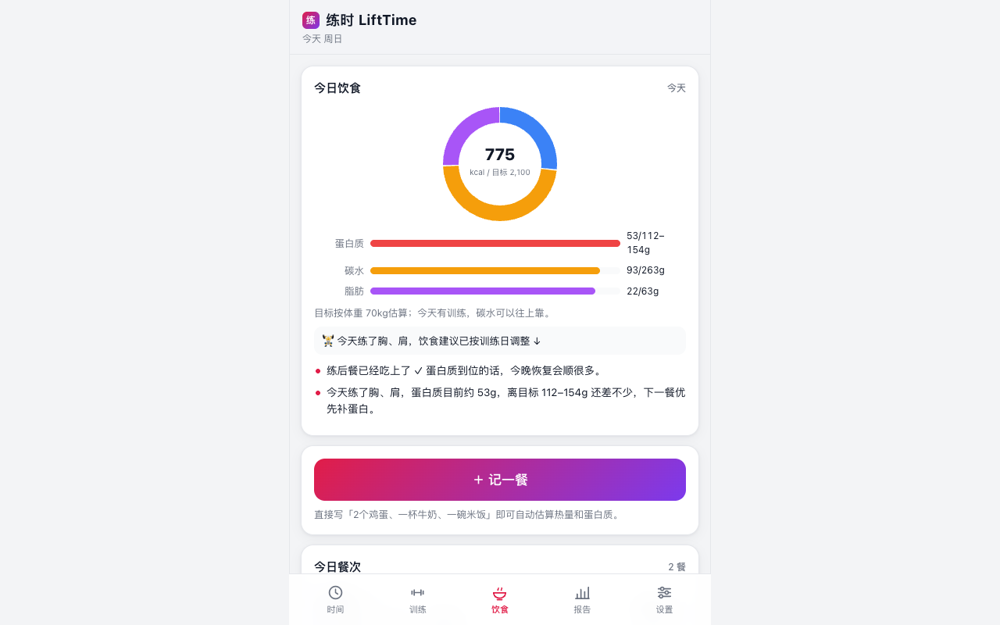

# 练时 LiftTime

手机端的时间分配 + 健身训练记录 App。

> 📲 **在线使用**：<https://nanami-0713.github.io/lifttime/>（手机浏览器打开，按下方方法「添加到主屏幕」即可当 App 用）一次点击开始计时、再一次点击停止，这段时间就被记下来；训练记下每个动作的重量×次数，App 自动告诉你这次练了什么部位、效果如何、练后和第二天身体会有什么感觉、怎么吃怎么休息恢复得快。所有数据只存在你手机本地，可离线使用。




## 功能

### ⏱ 时间分配
- **练前/日常计时**：点一下「开始记录」即锁定那个时刻，再点一下停止，两点之间的时段自动算作投入时间
- 停止后立即填写**这段时间做了什么**（热身激活 / 力量训练 / 有氧 / 通勤 / 备餐 / 补剂…，分类可自定义）
- 手动补记、编辑、删除；换设备前可导出备份
- **分布图**：当日 24 小时时间轴、按类别的环形占比图、近 7/30 天每日堆叠柱状图

### 🏋️ 训练记录
- 动作库内置 100+ 常见动作（含别名与变式，如「史密斯深蹲/T杠划船/山羊挺身/战绳」），自动映射目标肌群；查不到的动作可自定义并指定部位
- 逐组记录**重量 × 次数**，自重/有氧动作重量可留空，支持 kg/lb
- 结束时记录练后自感与备注

### 🧠 自动训练简评（每次练完生成）
- **练了什么**：主练部位与次重点（按各肌群容量占比计算）、总容量/组数/次数、强度评估（每组估算 1RM 与历史最好对比）
- **练的效果**：个人纪录识别（区分「刷新纪录」与「首次建立基准」）、课内推/拉/腿结构点评
- **身体会怎样**：练后即时感觉预测 + 第二天酸痛（DOMS）等级预估（综合容量变化、动作新鲜度、离心刺激与部位）
- **怎么恢复**：按体重换算的蛋白质克数、碳水与补水建议、睡眠与主动恢复建议、目标肌群拉伸放松
- 当天的时间投入会并入简评（「算上热身整理，今天为训练共花掉 1 小时 10 分」）

### 🤖 AI 简评（可选，接入智谱 GLM）
- 在「设置 → AI 简评」填入智谱 API Key（GLM Coding Plan）后，每次训练结束自动调用大模型（默认 `glm-5.3-flash`、思考强度 `max`）生成简评：简评正文、练后感觉、次日预测、饮食与恢复建议全部由模型结合你的**实际数据**（动作、容量、PR、当天饮食摄入、近几次训练）撰写
- 规则版简评作为兜底：未配置 Key、API 失败、超时、离线时都自动回退，不影响使用
- 训练详情页可对历史训练点「🤖 用 AI 重新生成简评」
- Key 只存在本机浏览器；若浏览器直连被 CORS 拦截，仓库附带 `scripts/cors-proxy-worker.js`（Cloudflare Workers 免费部署 3 分钟），把「接口地址」改成你的 Worker 地址即可

### 🍚 饮食记录
- **记一餐**：直接写「2个鸡蛋、一杯牛奶、一碗米饭」，自动按食物库（70+ 常见食物）估算热量与蛋白质/碳水/脂肪，支持中文数字（两碗）、克数（200g鸡胸）、尾部写法（米饭300g）
- **没认出来的食物帮你估**：按关键词猜类别（肉菜/主食/汤/零食/饮品/素菜…）和克数给出一版估算，预填到热量与三大营养素输入框，每一项都可以手动改；也可以整项「不计入」只保留文字；配置了 AI 的话还能点「🤖 AI 估」让模型帮你算
- **自学习食物库**：手估/手填过的食物自动进「我的食物库」，下次写同样的名字直接识别（可管理可删除）
- 内置食物库 320+ 项：细分肉蛋水产、中餐家常菜（红烧肉/宫保鸡丁/黄焖鸡…）、早餐面点、蔬果坚果、零食饮品，支持「两/袋/套/瓣/串/段」等单位（二两白酒=100g）
- 餐次：早餐/午餐/晚餐/加餐/练前餐/练后餐；练后 2.5 小时内记餐自动预选「练后餐」
- **每日总结**：宏量营养素环形图 + 按体重目标的蛋白质/碳水/脂肪进度条 + 当日建议
- **每周/每月总结**：日均热量与蛋白质、达标天数、每日热量堆叠图、最常吃的食物、建议

### 🔗 训练 × 饮食联动
- 饮食页识别当天训练，横幅提示并按训练日调整建议；练后没吃练后餐会提醒，吃了会打 ✓
- 训练简评的恢复建议会读取当天**实际已摄入**的蛋白质，告诉你还差多少克
- 报告页日简报并入当日饮食汇总；训练日蛋白质不达标会标黄提醒
- 阶段总结给出「训练日蛋白质达标率」，看饮食是否真的在支撑训练

### 💰 预算
- **周/月预算计划**：设置后实时显示进度条、剩余额度、「今天起日均还能花多少」；按当前花销节奏预测是否超支并提前提醒
- **自定义周期计划**：选开始和结束日期即可（时长自动算），金额天数完全自由，可多个并存；未开始/进行中/已结束三种状态分别展示，结束后一键「再来一期」；节奏超支时给出「每天控制在 ¥X 内」的拉回建议
- 记一笔：金额 + 分类（食材采购/外卖外食/聚餐/补剂/健身相关/其他）+ 备注
- 周/月总结：每日开销堆叠图、分类构成环形图、餐饮占比、建议

### 🔗 预算 × 饮食联动
- 在「饮食」记餐时填了花费的，自动计入预算的「记餐开销」，不用记两遍
- **蛋白质性价比**：自动算「本周记餐花费 ¥X 换来蛋白质 Yg（折合 ¥Z/10g）」，并对照鸡胸/鸡蛋/蛋白粉的参考成本给出建议
- 外卖/聚餐花费占比高但蛋白质达标率低时，会提醒你「钱花出去了营养没跟上」
- 报告页日简报并入当日/当周开销与预算进度

### 📊 阶段状态（近 7/30/90 天）
- 训练频率、总容量与环比趋势、部位分布环形图、每日容量柱状图
- 结构平衡提醒（推拉失衡、下肢占比过低、核心缺失…）
- 连续训练天数与恢复提示、期间个人纪录列表、整体状态评价与建议

### 📱 体验与兼容
- 移动端优先的 PWA：可「添加到主屏幕」全屏运行，离线可用（Service Worker 应用壳缓存）
- 零第三方依赖、零外部请求：纯 HTML/CSS/原生 ES Modules，图表为手写 SVG，弱网/无网环境照常使用
- 深色/浅色跟随系统（可手动切换）、适配 iPhone 刘海安全区、44px+ 触控目标、隐私模式下自动降级提示导出
- 数据仅在本地（localStorage），设置页一键导出/导入 JSON 备份

## 手机上安装

| 平台 | 方法 |
| --- | --- |
| iPhone / iPad | Safari 打开网页 → 分享按钮 → 「添加到主屏幕」 |
| Android | Chrome 打开网页 → 菜单 → 「安装应用」 |
| 电脑 | Chrome/Edge 地址栏右侧安装图标 |

安装后即可离线使用，数据不会离开设备。

## 快速上手

1. **时间页**：练前要做的事（换衣服、通勤、热身）点「开始记录」，做完点「停止并记录」，选个分类保存
2. **训练页**：点「开始训练」→ 添加动作 → 填重量×次数逐组记录 → 「结束训练」选练后感觉
3. **报告页**：看当天的日简报与这段时间的训练状态；建议在「设置」里填体重，恢复建议会给出具体蛋白质克数

## 分析口径（简要）

- 组容量 = 重量 × 次数（自重动作计组数与次数）
- 肌群容量按动作的主要/次要肌群系数分摊；占比 ≥25% 判定为主练、≥12% 为次重点
- 估算 1RM 采用 Epley 公式 `w × (1 + reps/30)`（次数封顶 15）
- 次日酸痛等级由容量相对变化、新动作比例、离心类动作与训练部位综合加权得出
- 所有建议为基于通用训练科学常识的规则生成，供参考，不构成医疗建议

## 开发

```bash
npm test          # 单元测试（训练 55 + 饮食 74 + 预算 45 + AI 39，共 213 项断言）
npm run icons     # 重新生成 PWA 图标（纯 Node PNG 编码）
npm run serve     # 本地预览 http://localhost:8130

# AI 简评本地验收（无需真实 Key）：
node scripts/mock-ai-server.mjs   # 起本地模拟智谱 API，设置里接口填 http://127.0.0.1:8131

# 一键「测试 + 扫描 + 提交 + 推送 + 等 Pages 构建」：
bash scripts/verify-and-push.sh "提交信息"
```

无构建步骤：改完刷新即生效（Service Worker 版本号在 `sw.js` 顶部，发版时记得递增）。

## Roadmap

- [x] 饮食板块：记餐、宏量营养素估算、日/周/月总结
- [x] 预算板块：周/月预算、开销记录、蛋白质性价比
- [ ] 更多生活板块：睡眠、学习/工作的时间分配
- [ ] 周报/月报导出为图片或 PDF
- [ ] 自定义动作库管理与动作历史曲线
- [ ] 可选的端到端加密云同步（多设备）
- [ ] Apple Health / Google Fit 数据导入

## License

[MIT](LICENSE)
