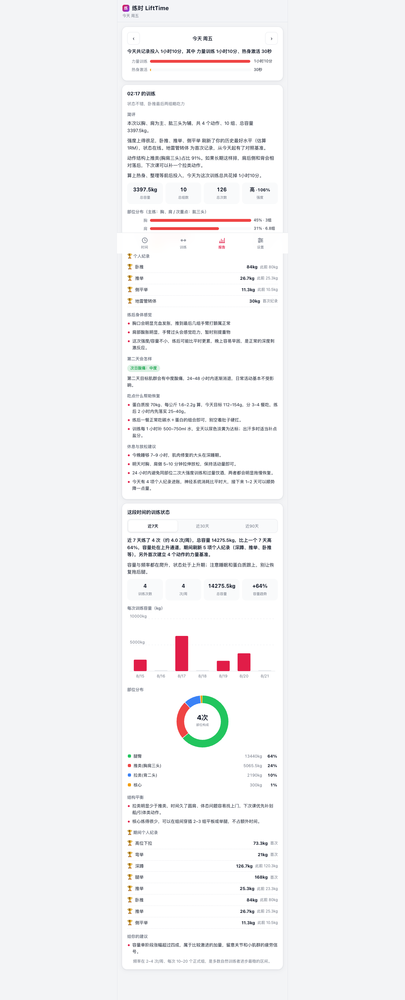

# 练时 LiftTime

手机端的时间分配 + 健身训练记录 App。一次点击开始计时、再一次点击停止，这段时间就被记下来；训练记下每个动作的重量×次数，App 自动告诉你这次练了什么部位、效果如何、练后和第二天身体会有什么感觉、怎么吃怎么休息恢复得快。所有数据只存在你手机本地，可离线使用。



## 功能

### ⏱ 时间分配
- **练前/日常计时**：点一下「开始记录」即锁定那个时刻，再点一下停止，两点之间的时段自动算作投入时间
- 停止后立即填写**这段时间做了什么**（热身激活 / 力量训练 / 有氧 / 通勤 / 备餐 / 补剂…，分类可自定义）
- 手动补记、编辑、删除；换设备前可导出备份
- **分布图**：当日 24 小时时间轴、按类别的环形占比图、近 7/30 天每日堆叠柱状图

### 🏋️ 训练记录
- 动作库内置 50+ 常见动作（含别名，如「杠铃卧推/RDL/肩推」），自动映射目标肌群；查不到的动作可自定义并指定部位
- 逐组记录**重量 × 次数**，自重/有氧动作重量可留空，支持 kg/lb
- 结束时记录练后自感与备注

### 🧠 自动训练简评（每次练完生成）
- **练了什么**：主练部位与次重点（按各肌群容量占比计算）、总容量/组数/次数、强度评估（每组估算 1RM 与历史最好对比）
- **练的效果**：个人纪录识别（区分「刷新纪录」与「首次建立基准」）、课内推/拉/腿结构点评
- **身体会怎样**：练后即时感觉预测 + 第二天酸痛（DOMS）等级预估（综合容量变化、动作新鲜度、离心刺激与部位）
- **怎么恢复**：按体重换算的蛋白质克数、碳水与补水建议、睡眠与主动恢复建议、目标肌群拉伸放松
- 当天的时间投入会并入简评（「算上热身整理，今天为训练共花掉 1 小时 10 分」）

### 📊 阶段状态（近 7/30/90 天）
- 训练频率、总容量与环比趋势、部位分布环形图、每日容量柱状图
- 结构平衡提醒（推拉失衡、下肢占比过低、核心缺失…）
- 连续训练天数与恢复提示、期间个人纪录列表、整体状态评价与建议

### 📱 体验与兼容
- 移动端优先的 PWA：可「添加到主屏幕」全屏运行，离线可用（Service Worker 应用壳缓存）
- 零第三方依赖、零外部请求：纯 HTML/CSS/原生 ES Modules，图表为手写 SVG，弱网/无网环境照常使用
- 深色/浅色跟随系统（可手动切换）、适配 iPhone 刘海安全区、44px+ 触控目标、隐私模式下自动降级提示导出
- 数据仅在本地（localStorage），设置页一键导出/导入 JSON 备份

## 手机上安装

| 平台 | 方法 |
| --- | --- |
| iPhone / iPad | Safari 打开网页 → 分享按钮 → 「添加到主屏幕」 |
| Android | Chrome 打开网页 → 菜单 → 「安装应用」 |
| 电脑 | Chrome/Edge 地址栏右侧安装图标 |

安装后即可离线使用，数据不会离开设备。

## 快速上手

1. **时间页**：练前要做的事（换衣服、通勤、热身）点「开始记录」，做完点「停止并记录」，选个分类保存
2. **训练页**：点「开始训练」→ 添加动作 → 填重量×次数逐组记录 → 「结束训练」选练后感觉
3. **报告页**：看当天的日简报与这段时间的训练状态；建议在「设置」里填体重，恢复建议会给出具体蛋白质克数

## 分析口径（简要）

- 组容量 = 重量 × 次数（自重动作计组数与次数）
- 肌群容量按动作的主要/次要肌群系数分摊；占比 ≥25% 判定为主练、≥12% 为次重点
- 估算 1RM 采用 Epley 公式 `w × (1 + reps/30)`（次数封顶 15）
- 次日酸痛等级由容量相对变化、新动作比例、离心类动作与训练部位综合加权得出
- 所有建议为基于通用训练科学常识的规则生成，供参考，不构成医疗建议

## 开发

```bash
npm test          # 分析引擎单元测试（47 项断言）
npm run icons     # 重新生成 PWA 图标（纯 Node PNG 编码）
npm run serve     # 本地预览 http://localhost:8130
```

无构建步骤：改完刷新即生效（Service Worker 版本号在 `sw.js` 顶部，发版时记得递增）。

## Roadmap

- [ ] 更多生活板块：睡眠、饮食、学习/工作的时间分配
- [ ] 周报/月报导出为图片或 PDF
- [ ] 自定义动作库管理与动作历史曲线
- [ ] 可选的端到端加密云同步（多设备）
- [ ] Apple Health / Google Fit 数据导入

## License

[MIT](LICENSE)
